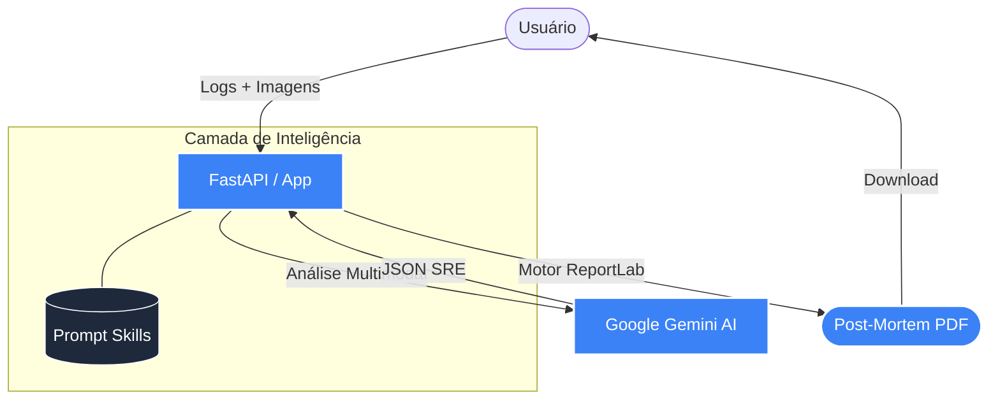

# 🚀 PROD POST-MORTEM AI

**PROD POST-MORTEM AI EXECUTIVE REPORT** é um sistema inteligente concebido para ajudar equipes de Engenharia de Confiabilidade (SRE) e Plataforma. Ele ingere logs massivos, transcrições de chats complexos e cria **Post-Mortems Automáticos** super completos com IA, detalhando as raízes dos incidentes (5 Whys), métricas, impacto no raio de explosão (Blast Radius) e os disponibiliza instantaneamente no seu painel em formato PDF profissional! 

Nós nos orgulhamos de ter uma arquitetura leve, desacoplada e modularizada segundo as melhores práticas modernas do mercado usando Python e FastAPI.

---

## 🏗️ Arquitetura e Fluxo Assíncrono

Utilizamos uma organização rigorosamente isolada, separando o Servidor (Backend) do Cliente (Frontend):



A estrutura interna no seu disco é esta base limpa e escalável:

```text
prod-postmortem-ai/
├── app/                  # Núcleo lógico da API
│   ├── main.py           # Hub central e middleware
│   ├── api/              # Rotas da API
│   │   ├── __init__.py
│   │   └── endpoints.py  # Handlers de requisição
│   ├── schemas.py        # Validação com Pydantic
│   ├── services.py       # Lógica de IA e PDF
│   ├── skills/           # Prompts e conhecimentos externos (Skills)
│   │   ├── sre_report_skill.md
│   │   └── ...
│   └── __init__.py
│
├── static/               # Assets do Frontend
│   ├── index.html
│   ├── style.css
│   ├── script.js
│   └── example_logs.txt  # Exemplo de logs para teste
│
├── docker-compose.yml    # Orquestração Docker
├── Dockerfile            # Imagem do container
├── pyproject.toml        # Dependências do projeto
├── uv.lock               # Lockfile do 'uv'
└── README.md             # Esta documentação
```

---

## ✨ Features da Plataforma

*   **Multimodal Vision (Evidencias de Monitoramento)**: Arraste, solte ou cole (`Ctrl+V`) capturas de tela dos seus dashboards (Datadog, Grafana, etc). O Gemini analisa visualmente a falha e as imagens sao inseridas no PDF e DOCX como evidencia de monitoramento.
*   **Big Numbers (Metricas Executivas)**: Cards com layout moderno, texto auto-ajustavel e duas fileiras — fixas e dinamicas. Detalhes completos na secao abaixo.
*   **Pre-visualizacao Editavel**: Apos a LLM gerar o relatorio, um painel de preview permite revisar e editar todos os campos (titulo, metricas, resumo executivo, causa raiz, resolucao, proximos passos, timeline) antes de exportar o PDF ou DOCX.
*   **Toggle de Idioma (PT-BR / English)**: Labels do PDF, DOCX e instrucao da LLM sao controlados por um toggle — gera tudo em portugues ou tudo em ingles.
*   **Incidente Proativo**: Toggle Sim/Nao para indicar se o incidente foi detectado proativamente. Preenchido no DOCX automaticamente.
*   **Timeline Exaustiva**: A LLM e instruida a nao resumir a timeline. Cada evento pode ter um campo `detail` opcional com contexto tecnico, comandos, links e evidencias. Incidentes P1 de 30+ horas geram 30-50+ eventos.
*   **Exportacao Dupla (PDF + DOCX)**: PDF profissional com logo StackSpot para distribuicao. DOCX editavel baseado em template corporativo para edicao no Google Docs/Word.
*   **Time Range Engine (Fallback Matematico)**: Se os logs possuirem buracos de tempo, a IA utiliza janelas explicitas do usuario para travar bordas de downtime e calcular SLAs de forma deterministica.

---

## 📊 Big Numbers (Metricas do PDF)

O PDF exibe cards visuais com metricas-chave do incidente, organizados em **duas fileiras**:

### Row 1 — Cards Fixos (sempre presentes)

Esses 4 cards aparecem **sempre** no PDF, independente dos campos preenchidos:

| Card | Label | Fonte do dado | Regras |
|------|-------|---------------|--------|
| 1 | **Criticidade** | Campo "Impact" selecionado pelo usuario no dashboard (P1 - Critico, P2 - Alto, P3 - Medio) | Obrigatorio. Preenchido via impact pills no frontend |
| 2 | **Downtime / MTTR** | Calculado pela LLM a partir dos logs ou informado via Time Range | Formato legivel: "4 horas e 36 minutos" |
| 3 | **Status** | Determinado pela LLM (Resolvido, Ongoing, etc) | Fica verde quando "Resolvido" |
| 4 | **Cliente Afetado** | Campo "Affected Customers" preenchido pelo usuario no dashboard | **Plural automatico**: quando contem virgula ou " e ", o label muda para "Clientes Afetados" |

> Os cards fixos **nao possuem subtitulo** — apenas o label e o valor em destaque.

### Row 2 — Cards Dinamicos (aparecem somente quando preenchidos)

Esses cards **so aparecem** quando o usuario preenche o campo correspondente no dashboard. Se nenhum for preenchido, a row 2 nao e renderizada:

| Card | Label | Campo no Frontend | Exemplo |
|------|-------|-------------------|---------|
| 1 | **SLO** | Input "SLO" | `99.9%` |
| 2 | **% Requisicoes Afetadas** | Input "% Requisicoes Afetadas" | `98%` ou `100% - Indisponibilidade Total` |
| 3 | **Jornadas Impactadas** | Input "Jornadas Impactadas" | `Checkout, Login` |
| 4 | **Perda Estimada** | Input "Perda Estimada" | `R$ 50.000` |

> Esses campos sao informados **manualmente pelo usuario** no painel de parametros do frontend, nao sao gerados pela LLM.

### Regras de Layout dos Cards

- **Auto-fit de texto**: O tamanho da fonte do valor se ajusta automaticamente:
  - Ate 12 caracteres: fonte 16pt (bold)
  - 13-20 caracteres: fonte 13pt (bold)
  - 20+ caracteres: fonte 10pt (bold)
- **Overflow protection**: O valor nunca escapa do bloco do card — e clampado para caber na altura disponivel
- **Subtitulo condicional**: So e renderizado se tiver conteudo (nao ocupa espaco vazio)
- **Gap entre cards**: 10px de espaco entre cada card
- **Largura**: Calculada automaticamente dividindo a largura util da pagina pelo numero de cards

### Campos do Dashboard → Big Numbers → DOCX

Os mesmos campos preenchidos no frontend tambem sao utilizados no DOCX editavel:

| Campo Frontend | Big Number (PDF) | Campo no Template DOCX |
|----------------|------------------|----------------------|
| Impact pill | Criticidade | Impacto |
| Time Range / LLM | Downtime / MTTR | Duracao |
| LLM | Status | Status |
| Affected Customers | Cliente(s) Afetado(s) | Canal do incidente |
| SLO | SLO | Impacto SLA/SLO |
| % Requisicoes Afetadas | % Requisicoes Afetadas | % de requisicoes afetadas |
| Jornadas Impactadas | Jornadas Impactadas | (nao mapeado no template atual) |
| Perda Estimada | Perda Estimada | Perda estimada (receita ou produtividade) |
| Proativo toggle | (nao exibido no PDF) | Incidente Proativo? |

---

## ⚡ Como Rodar o Projeto (Passos Rápidos)

Nós preparamos tudo para que seja o mais fácil e moderno de se iniciar o serviço localmente! Siga os passos abaixo, mesmo que você não possua grandes conhecimentos de ambiente:

### 📌 1. Declare sua Chave (Totalmente Grátis)
Abra o [Google AI Studio](https://aistudio.google.com/app/apikey) e crie uma nova API Key para utilizar o Gemini nativo. 
Na pasta raiz deste projeto, utilize o arquivo `.env.example` como base para criar o seu arquivo `.env`:
```env
GOOGLE_API_KEY=AI...sua_chave_linda_aqui
```

---

### Execução via Docker (Opção Mais Simples - Recomendado)
*Para quem quer 0 esforço de instalação (Requer apenas [Docker](https://www.docker.com/) instalado no seu PC):*

1. Abra seu terminal de comando e garanta que você está na pasta do projeto.
2. Digite este comando único e dê enter:
```bash
docker compose up -d --build
```
3. Aguarde uns segundinhos e acesse **http://localhost:8000** no seu navegador!

---

### Execução Nativa usando Python `uv`
*Se preferir trabalhar na máquina crua (Baremetal) ou desenvolver diretamente no código:*

1. Instale o gerenciador ultrarápido oficial (`uv`):
   *(Unix/Mac)* `curl -LsSf https://astral.sh/uv/install.sh | sh`
   *(Windows)* `powershell -ExecutionPolicy ByPass -c "irm https://astral.sh/uv/install.ps1 | iex"`
2. Dentro da pasta, inicie o app sem precisar ativar o ambiente virtual manualmente:
```bash
uv run uvicorn app.main:app --reload
```
3. O servidor vai abrir! Vá em **http://localhost:8000** no seu próprio browser e divirta-se.

---

## 🛠️ Solução de Problemas (Troubleshooting)

### Docker não encontrado no WSL 2 (Windows)
Se você utiliza Windows com WSL (Subssistema Windows para Linux) e, ao rodar o comando docker, receber o erro `The command 'docker' could not be found in this WSL 2 distro`, você precisa ativar a integração do Docker Desktop com o seu ambiente Linux:

1. Abra o **Docker Desktop** no Windows.
2. Acesse as **Settings** (ícone de engrenagem no canto superior direito).
3. Vá em **Resources > WSL Integration**.
4. Ative a opção **"Enable integration with my default WSL distro"** e marque a caixa da sua distribuição Linux (ex: *Ubuntu*).
5. Clique em **Apply & restart**.
6. Feche e abra o seu terminal do WSL novamente. Agora o comando rodará perfeitamente e com alta performance de leitura de arquivos!